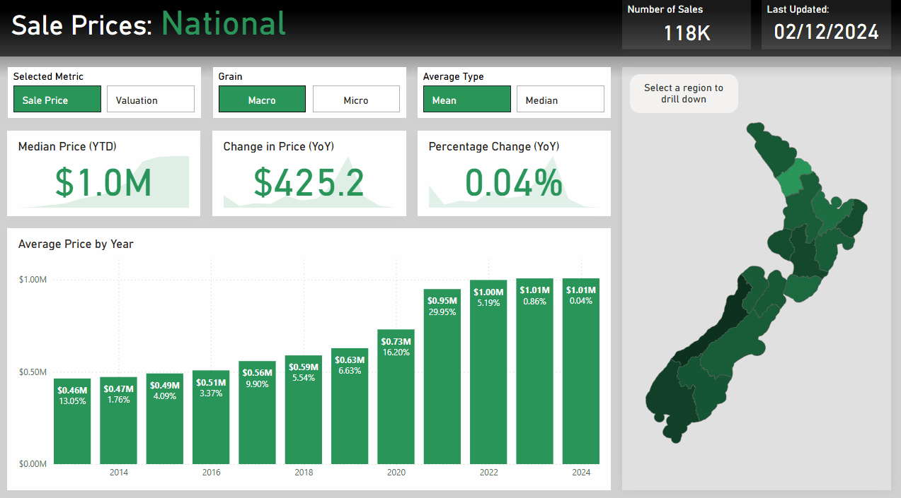

# property_tracker
Real estate property information web scraper and data modelling

Uses publicly avaliable information on realestate.co.nz to create a database of historic house sale prices and valuations all across New Zealand. This database is then used in conjunction with regional maps to create an interactive PowerBI report, allowing for easy drill down into property types and regional trends. Using a properly structured database and smart DAX queries, the user can easily switch between yearly / monthly trends, sale prices / valuations, mean / median prices, and Region / Districts.

